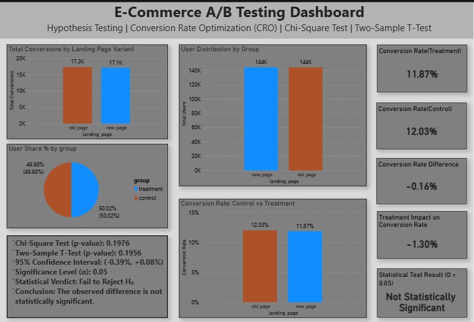

# E-Commerce-A-B-Testing-Dashboard
Data Analytics project analyzing an e-commerce A/B testing experiment using SQL, Python, and Power BI. 
Performed data cleaning, statistical hypothesis testing, confidence interval analysis, and created an executive
dashboard to evaluate landing page performance.

## Project Overview

This project presents an end‑to‑end A/B testing analysis conducted on an e‑commerce landing page 
experiment using the Kaggle **A/B Testing Dataset by Zhang Luyuan**.
The objective was to determine whether a new landing page design (treatment group) significantly 
improves conversion rates compared to the existing design (control group).
The project combines SQL for data extraction, Python for statistical hypothesis testing, and Power BI 
for executive‑level dashboard storytelling.

---

## Business Problem

An e‑commerce company introduced a new landing page design and conducted an A/B test to evaluate its impact on user conversion.

**Primary Question:**  
Does the new landing page increase conversion rate compared to the old landing page?

---

## Experiment Design

- Control Group → Old landing page  
- Treatment Group → New landing page  
- Conversion defined as: `converted = 1`  
- Users randomly split between both groups  

### Sample Size

- Control Users: ~144,000  
- Treatment Users: ~144,000  
- Traffic allocation: ~50% / 50%  
- Total Users: ~288,000  

The experiment was well balanced with a large sample size.

---

## Tools & Technologies

- SQL (SQLite in Google Colab)
- Python (Pandas, NumPy, SciPy)
- Statistical Testing (Chi‑Square Test, Two‑Sample T‑Test)
- 95% Confidence Interval
- Power BI (Dashboard Design & Storytelling)

---

## Data Preparation

The following preprocessing steps were performed:

- Removed duplicate user entries
- Removed mismatched landing page and group combinations
- Ensured each user appeared only once
- Stored cleaned dataset in SQL for querying

---

## Key Results

### Conversion Rates

- Control Conversion Rate: **12.03%**
- Treatment Conversion Rate: **11.87%**

### Performance Impact

- Absolute Difference: **−0.16 percentage points**
- Relative Lift: **−1.30%**

The treatment page performed slightly worse than the control.

---

## Statistical Analysis

Two statistical tests were performed:

### 1. Chi‑Square Test  
- p-value = **0.1976**

### 2. Two‑Sample T‑Test  
- p-value = **0.1956**

Significance Level (α) = **0.05**

Since p > 0.05 in both tests, we fail to reject the null hypothesis.

There is no statistically significant difference between the two landing pages.

---

## 95% Confidence Interval

Confidence Interval for (Treatment − Control):

**−0.39% to +0.08%**

Because the interval includes zero, the true conversion difference may be negative or positive. This confirms the absence of statistically significant improvement.

---

## Business Interpretation

Although the treatment page shows a −1.30% relative lift, statistical testing indicates that this difference is likely due to random variation rather than a real performance change.

The new landing page does not provide reliable evidence of conversion improvement.

---

## Final Recommendation

Do not deploy the new landing page.

Recommended next steps:

- Extend experiment duration  
- Test stronger UI/UX changes  
- Run additional controlled experiments  
- Conduct power analysis before future experiments  

---

## Dashboard Overview

The Power BI dashboard was designed to communicate results clearly to non‑technical stakeholders.

### Dashboard Highlights

1. Executive KPI Section  
   - Treatment Impact on Conversion Rate: **−1.30%**  
   - Control Conversion Rate: **12.03%**  
   - Treatment Conversion Rate: **11.87%**  
   - Conversion Rate Difference: **−0.16%**

2. Conversion Rate Comparison Chart  
   A direct visual comparison of control vs treatment conversion rates.

3. Sample Distribution  
   Approximately equal traffic allocation (~144K users per group).

4. Total Conversions by Landing Page  
   - Control: ~17.3K conversions  
   - Treatment: ~17.1K conversions  

5. Statistical Summary Panel  
   - Chi‑Square p-value: 0.1976  
   - T‑Test p-value: 0.1956  
   - 95% Confidence Interval: (−0.39%, +0.08%)  
   - Final Verdict: Not Statistically Significant  

The dashboard emphasizes clarity, statistical validity, and business decision‑making.

---

## Dashboard Preview

---

## Author 
Jiya Attar

Aspiring Data Analyst | Excel | PowerBI | SQL | Python
